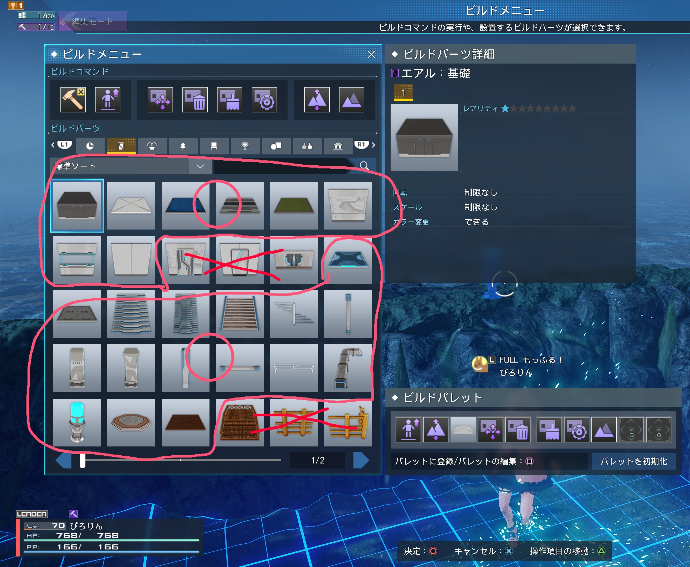

# Cost Limit

Regarding the cost/limit system there's two groups of items. Group A is high cost items like Cats, doors, logic stuff. Group B is tiny cost items like walls/floors/rocks/trees/etc.
You can place 500 high cost Group A items and 4000 low cost Group B items. These are independent counts so you can have 500 doors and 4000 walls. 

Source: [JP Twitter thread about it here](https://twitter.com/p1ror1n_/status/1667872958474518528)

